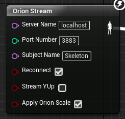
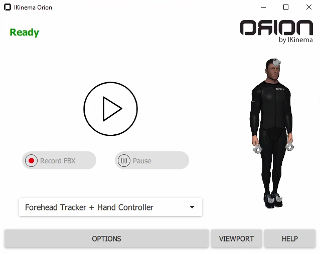

# Setting up IKinema Orion

This is a short guide on how to setup IKinema Orion for the purpose of this project and what to keep in mind. For more information check out the [official documentation for Orion](https://ikinema.com/index.php?mod=documentation&show=317).

## Installing Orion software

* First you log into the IKinema homepage. After logging in you will see a list of their software at the top. Click on **IKinema Orion** and download the installer. 

* The installer will ask you what you want to install. Make sure **Orion Streamer** is checked. 

* Also unfold **IKINEMA VRPN Unreal plug-in** and select the UE versions you want to download plugins for. If your current version of UE is not yet supported, just select the latest version. It will complain when starting your project later on, but probably still work.  

* You can uncheck **IKINEMA VRPN Unity plug-in** and **IKINEMA 3D Assets**. The last contains a skeletal mesh that is already included in this plugin. 
If you need the .fbx or a female version you can also keep it checked. 

* After finishing the installation you will have a folder with everything you need at your chosen location. The **UnrealStream** folder contains the plugin that you will have to put into your project. 

* You should also be able to start the **Orion** sofware using the start menu or a desktop shortcut. 

## Vive trackers

* For our setup we need a HTC Vive HMD, two Vive controlers and 3 or 5 Vive trackers. You can find out how to setup the HMD and controllers using their user manual or the internet, if you haven't done that yet. 

* The Vive trackers can be a little bit trickier sometimes. Make sure they are charged and once you have done that make sure to connect a wireless dongle for each tracker so they can communicate with the PC.

* Turn on the tracker by pressing the button in the middle. Then select **pair new controller** in SteamVR. If you get an error message telling you you can't add any additional controllers, you probably forgot to connect the dongle for the tracker. 

* Once SteamVR is searching for a controller press the button in the middle of the tracker for a couple of seconds until it's LED starts blinking blue. It will turn green once it is connected.

* We have encountered a bug where one of the trackers gets mistaken for a Vive controller in UE. The controller it was mistaken for stopped tracking completely and the trackers position was used instead.

* Disconnecting the trackers, restarting SteamVR and reconnecting them worked eventually. Also make sure that in Orion the correct marker setup is selected. (see **Calibrating Orion**)

## Streaming into UE

* To receive data in the Unreal Engine we need the **OrionStream** plugin. Copy it from your Orion installation folder into your projects plugin fodler. Make sure to use the right version of the plugin.

* This plugin's content folder already contains a skeletal mesh and 3 animated blueprints for it. Inside these ABPs the **Orion Stream** node is used to receive data from Orion and move the mesh. 

* Additionally the scale of certain bones is set to 0. This is done so they don't interfere with the players view later on. 

* In your VR pawn you simply add a skeletal mesh component and set it to the IKinemaMale mesh. Select one of the ABPs as an animation and turn it so it is facing the camera direction. 

* If later on the mesh is facing the wrong way, just turn the skeletal mesh component. 

## Calibrating Orion

* Once you start Orion you will see the following window. Press **viewport** to open a preview of what Orion is currently streaming. 

* Make sure to always select the right marker set after starting Orion, since it will reset after you close it. For 3 Vive trackers select **HMD + Hand Controller**. Note that the third vive tracker can't be seen on the preview picture since it is attached to the back. 

* For 5 Vive trackers select a setup where 2 additional trackers are attached to the elbows. This improves arm tracking, but isn't necessary since tracking is already pretty good to begin with. 

* If you don't need live data you can stream some of their prerecorded data by switching from **live** to **replay** under **options**.

* To calibrate Orion you press the play button. Afterwards put on the HMD. In the Vives default VR environmet you can see a coordinate system on the floor. Walk into the center of it.

* You will also see a small arrow on the floor. It shows you which direction you have to look. Once you are in the right position assume a t-pose and press the trigger button on one of the controllers. A mesh representing your movement should now appear in the Orion preview window.

* This whole process is done so the UE and Orion coordinate sytems are aligned. As a byproduct it also helps using your playspace optimally. 

* You can now start your unreal project in VR and the mesh should follow your movement. 